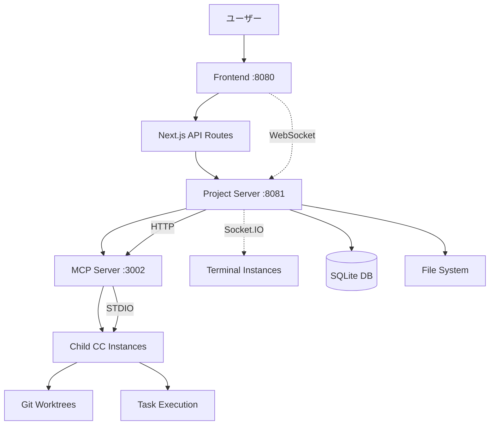

# Claude Code Terminal - 革命的MCP並列実行システム

> **🚀 革命的アーキテクチャ**: Model Context Protocol (MCP) + STDIO Transport による**完全自律型**Claude Code並列オーケストレーション

Claude Codeの**親子関係管理**と**並列タスク実行**を実現する次世代Webプラットフォーム。親Claude Codeが自律的に子インスタンスを生成・管理し、**ultrathinkプロトコル**によるリアルタイム通信で複雑なプロジェクトを効率的に処理します。

## ✨ 革新的特徴

### 🧠 **親子Claude Code階層システム**
- **親CC**: プロジェクト統括、タスク分析、子CC管理
- **子CC**: 独立worktreeでの並列タスク実行
- **ultrathinkプロトコル**: 確実な親子間コマンド伝達

### 🌊 **MCP STDIO Transport**
- **直接統合**: Claude CLIとの安全な標準入出力通信
- **JSON-RPC 2.0**: 標準準拠のプロトコル
- **高速通信**: オーバーヘッドの少ない直接通信

### ⚡ **完全自律型オーケストレーション**
- **MCP Server**: 並列実行制御の中央司令塔
- **自動Git Worktree**: タスクごとの隔離実行環境
- **リアルタイム監視**: ダッシュボードでの進捗可視化

### 🖥️ **完全なPTYサポート**
- **node-pty**: 真の疑似端末（PTY）サポート
- **Claude Code対応**: Raw modeとInkライブラリ完全サポート
- **インタラクティブ操作**: シームレスなターミナル体験

## 📋 主要機能

- 🖥️ **Webターミナル**: xterm.js + node-ptyによる完全ターミナル環境
- 📊 **プロジェクトダッシュボード**: shadcn/ui + Tailwind CSSによるモダンUI
- 🚀 **MCP並列実行**: 最大並列度での効率的タスク処理
- 📈 **リアルタイム監視**: WebSocketによる即座の状態更新
- 🔗 **タスク依存関係**: 自動依存解決とスケジューリング
- 🗄️ **Prisma データベース**: SQLiteによる軽量データ永続化
- 🌲 **Git Worktree**: 並列実行時のコード分離とマージ戦略
- 🎌 **完全日本語対応**: ネイティブ日本語UI/UX

## 🏗 技術スタック

### **フロントエンド**
```typescript
Next.js 14 (App Router)  // React フレームワーク
TypeScript              // 型安全性
Tailwind CSS v3         // ユーティリティCSS
shadcn/ui              // モダンUIコンポーネント
xterm.js               // ターミナルエミュレーション
Socket.IO Client       // リアルタイム通信
React Query            // データフェッチング
Zustand                // 状態管理
```

### **バックエンド**
```typescript
// MCP Server
STDIO Transport        // Claude CLI直接統合
JSON-RPC 2.0          // 標準プロトコル
execa                 // 子プロセス管理

// Project Server (Port 8081)  
Node.js                // JavaScript実行環境（必須）
Express.js + Socket.IO // WebSocket + HTTP API
Prisma ORM             // データベースORM
SQLite                 // 軽量データベース
node-pty               // 完全PTYサポート
tsx                    // TypeScript実行環境

// Frontend (Port 8080)
Next.js Server         // フロントエンドサーバー
```

### **Claude Code管理**
```bash
Git Worktree          # 並列実行環境分離
ultrathink Protocol   # 親子CC間通信
Process Management    # CCインスタンス管理
```

## 🚀 クイックスタート

### 前提条件

```bash
# 必須要件
Node.js >= 18.0.0      # node-ptyとの互換性のため必須
npm >= 8.0.0           # Node.jsパッケージマネージャー
Git >= 2.25.0          # worktree機能用

# C++コンパイラ (node-ptyのビルド用)
# macOS
xcode-select --install

# Ubuntu/Debian
sudo apt-get install build-essential

# Claude Code CLI
curl -fsSL https://claude.ai/install.sh | sh
```

### インストール

```bash
# リポジトリクローン
git clone <repository-url>
cd claude-code-terminal

# 依存関係インストール
npm install

# データベース初期化
npx prisma generate
npx prisma db push

# サンプルタスク追加（オプション）
node scripts/add-sample-tasks.js
```

### 起動方法

**🎯 3つのサーバーを同時起動:**

```bash
# すべてのサーバーを同時起動（推奨）
npm run dev

# または個別起動:
# ターミナル 1: Frontend (ポート 8080)
npm run dev:next

# ターミナル 2: Project Server (ポート 8081) 
npm run dev:server

# ターミナル 3: MCP Server (STDIO)
cd mcp-server && npm install && npm run build
```

### MCP サーバー設定

**必要なMCPサーバーをClaude CLIに登録:**

```bash
# 1. claude-code-parallel (本プロジェクト)
claude mcp add claude-code-parallel -- ~/.bun/bin/bun /path/to/cc-parallel-executor/mcp-server/src/index.ts

# 2. context7 (コンテキスト管理)
claude mcp add context7 -- npx -y @upstash/context7-mcp

# 3. puppeteer (ブラウザ自動化)
claude mcp add puppeteer -- npx @modelcontextprotocol/server-puppeteer

# 登録確認
claude mcp list
```

**🌐 アクセス:**
- **メインアプリケーション**: http://localhost:8080
- **プロジェクトダッシュボード**: http://localhost:8080/dashboard
- **ターミナル画面**: http://localhost:8080/terminal

## 🏢 システムアーキテクチャ

### **革命的階層構造**



### **MCP通信フロー**

```
親CC → MCP Server → Project Server → 子CC起動
   ↓        ↓              ↓
  STDIO   HTTP    Socket.IO → Git Worktree
```

### **コンポーネント詳細**

| コンポーネント | ポート | 役割 | 技術 |
|---------------|--------|------|------|
| **Frontend** | 8080 | UI/UX、ダッシュボード | Next.js, React |
| **Project Server** | 8081 | API、WebSocket、データ管理 | Express, Socket.IO, Prisma |
| **MCP Server** | - | 並列実行制御、STDIO Transport | MCP SDK |
| **Child CCs** | - | タスク実行、Git Worktree | Claude Code CLI |

## 🎮 使用方法

### **1. プロジェクト作成**

```bash
# ダッシュボードでGUIによる作成
http://localhost:3000/dashboard

# または REST API
curl -X POST http://localhost:3001/api/projects \
  -H "Content-Type: application/json" \
  -d '{
    "name": "ECサイト開発",
    "description": "Next.js + Prisma ECサイト",
    "workdir": "/path/to/project"
  }'
```

### **2. タスク定義アップロード**

```yaml
# tasks.yaml
tasks:
  - id: "ui-improvements"
    name: "UIコンポーネントの改善"
    description: "ダッシュボードのUIコンポーネントをリファクタリング"
    status: "pending"
    priority: 8
    taskType: "development"
    instruction: |
      ダッシュボードのUIコンポーネントを分析して、以下の改善を実装してください：
      1. レスポンシブデザインの改善
      2. アクセシビリティの向上
      3. カラーコントラストの最適化
      4. インタラクションの滑らかさの改善
```

### **3. 親CC起動**

```bash
# プロジェクトダッシュボードで「親CCを起動」ボタンクリック
# → ターミナルが表示され、Claude Codeが自動起動
# → ultrathinkプロトコルで子CC管理開始
```

### **4. MCP経由での子CC並列実行**

**親CCでのコマンド例:**

```typescript
// MCPツールは自動的にClaude Code内で実行
{
  "jsonrpc": "2.0",
  "id": 1,
  "method": "tools/call",
  "params": {
    "name": "create_child_cc",
    "arguments": {
      "parentInstanceId": "parent-cc-123",
      "taskId": "ui-improvements",
      "instruction": "UIコンポーネントの改善を並列実行してください",
      "projectWorkdir": "/path/to/project"
    }
  }
}
```

**自動実行される処理:**
1. 🌿 Git worktree作成 (`worktree-child-cc-456`)
2. ⚡ 子CCプロセス起動 (独立環境)
3. 📡 ultrathinkプロトコルによるタスク指示送信
4. 📊 リアルタイム進捗のWebSocket配信
5. 🖥️ ダッシュボードに新ターミナルタブ追加

## 🔧 API仕様

### **MCP Server APIs**

#### **利用可能なタスク取得**
```bash
// MCPツールは自動的にClaude Code内で実行
{
  "jsonrpc": "2.0",
  "method": "tools/call",
  "params": {
    "name": "get_available_tasks",
    "arguments": {
      "projectId": "cmbm74nxp0000b9dljybiwfik"
    }
  }
}
```

#### **子CC起動**
```bash
// MCPツールは自動的にClaude Code内で実行
{
  "jsonrpc": "2.0", 
  "method": "tools/call",
  "params": {
    "name": "create_child_cc",
    "arguments": {
      "parentInstanceId": "parent-123",
      "taskId": "task-456", 
      "instruction": "詳細なタスク指示",
      "projectWorkdir": "/project/path"
    }
  }
}
```

#### **タスク状況更新**
```bash
// MCPツールは自動的にClaude Code内で実行
{
  "jsonrpc": "2.0",
  "method": "tools/call", 
  "params": {
    "name": "update_task_status",
    "arguments": {
      "taskId": "task-456",
      "status": "completed",
      "result": "実行結果データ"
    }
  }
}
```

### **Project Server APIs**

#### **プロジェクト管理**
```bash
# 一覧取得
GET /api/projects

# 詳細取得  
GET /api/projects/:projectId

# 作成
POST /api/projects
{
  "name": "プロジェクト名",
  "description": "説明",
  "workdir": "/path/to/project"
}

# 更新
PATCH /api/projects/:projectId

# 削除
DELETE /api/projects/:projectId
```

#### **タスク管理**
```bash
# プロジェクトのタスク一覧
GET /api/projects/:projectId/tasks

# 実行可能タスク取得
GET /api/tasks/ready/:projectId

# タスク詳細
GET /api/tasks/:taskId

# タスク状況更新
PATCH /api/tasks/:taskId/status
{
  "status": "running|completed|failed",
  "result": "実行結果"
}
```

#### **CC管理**
```bash
# CC一覧
GET /api/cc

# 親CC作成
POST /api/cc/parent
{
  "projectId": "project-123",
  "name": "親CC名"
}

# 子CC作成（MCP経由）
POST /api/cc/child
{
  "parentInstanceId": "parent-123",
  "taskId": "task-456", 
  "instruction": "タスク指示",
  "projectWorkdir": "/project/path"
}
```

## 📁 プロジェクト構造

```
claude-code-terminal/
├── 📱 app/                          # Next.js App Router
│   ├── page.tsx                     # ホームページ
│   ├── dashboard/                   # プロジェクトダッシュボード  
│   │   ├── page.tsx                # プロジェクト一覧
│   │   └── [projectId]/page.tsx    # プロジェクト詳細
│   ├── terminal/page.tsx            # ターミナルページ
│   ├── parallel/page.tsx            # 並列実行ページ
│   ├── control/page.tsx             # APIコントロールページ
│   └── api/                         # Next.js APIルート
│       └── projects/[projectId]/tasks/route.ts
├── 🎨 components/                   # shadcn/ui コンポーネント
│   ├── dashboard/                   # ダッシュボード専用
│   │   ├── create-project-dialog.tsx
│   │   ├── project-card.tsx
│   │   └── task-upload-dialog.tsx
│   ├── terminal/                    # ターミナル専用
│   │   ├── cc-terminal.tsx
│   │   ├── simple-terminal.tsx
│   │   ├── terminal-tabs.tsx
│   │   └── terminal-wrapper.tsx
│   └── ui/                          # 汎用UIコンポーネント
├── 📚 docs/                         # 技術ドキュメント
│   ├── architecture.md             # システム設計
│   ├── requirements.md             # 要件定義
│   ├── database-design.md          # DB設計
│   └── task-structure.yaml         # タスク定義サンプル
├── 🔧 lib/                          # ライブラリ・ユーティリティ
│   ├── api/client.ts               # API クライアント
│   ├── hooks/useProjects.ts        # React カスタムフック
│   ├── stores/project.store.ts     # Zustand 状態管理
│   └── utils.ts                    # 共通ユーティリティ
├── 🤖 mcp-server/                   # MCP Server (革命的!)
│   ├── src/
│   │   ├── index.ts                # MCPサーバーエントリーポイント
│   │   ├── index.ts                # MCPサーバーエントリーポイント
│   │   ├── tools/child-cc.ts       # 子CC管理ツール
│   │   └── types.ts                # TypeScript型定義
│   ├── package.json                # MCP依存関係
│   └── tsconfig.json               # MCP TypeScript設定
├── 🗄️ prisma/                       # データベース
│   └── schema.prisma               # Prisma スキーマ
├── 📜 scripts/                      # ユーティリティスクリプト
│   └── add-sample-tasks.js         # サンプルタスク追加
├── 🖥️ server/                       # Project Server (Port 3001)
│   ├── api/                        # REST API
│   │   ├── cc.ts                   # CC管理API
│   │   ├── projects.ts             # プロジェクト管理
│   │   └── tasks.ts                # タスク管理
│   ├── services/                   # ビジネスロジック
│   │   ├── cc.service.ts           # CC制御サービス
│   │   ├── terminal.service.ts     # ターミナル管理
│   │   └── worktree.service.ts     # Git Worktree管理
│   └── utils/                      # サーバーユーティリティ
│       ├── logger.ts               # ログ管理
│       ├── prisma.ts               # Prisma クライアント
│       └── validation.ts           # バリデーション
├── server-simple.cjs               # WebSocket ターミナルサーバー
├── server-unbuffer.cjs             # unbuffer PTY サーバー
├── CLAUDE.md                       # Claude Code ガイド
└── README.md                       # このファイル
```

## 🔬 ultrathink プロトコル

**親CCから子CCへの確実な指示伝達メカニズム**

### **送信フォーマット**
```bash
ultrathink

タスク実行指示:
タスクID: task-123
親CCインスタンス: parent-cc-456

作業指示:
[詳細なタスク指示]

このworktreeで独立してタスクを実行し、完了後は結果を報告してください。
```

### **子CC側の処理**
1. `ultrathink` キーワード検出
2. タスク実行モードに移行  
3. 指示内容の解析と実行
4. 進捗レポート送信
5. 完了通知

### **プロトコル特徴**
- ✅ **確実性**: キーワードベースの明確な識別
- 🔒 **安全性**: 親CCからの正当な指示のみ実行
- 📡 **双方向**: リアルタイム進捗フィードバック
- 🌿 **分離性**: Git worktreeによる実行環境隔離

## 🎯 実装状況

### **Phase 1: 基盤システム** ✅ **完了**
- [x] Next.js 14 + TypeScript基盤
- [x] shadcn/ui モダンUI実装
- [x] Prisma + SQLite データベース
- [x] WebSocket + Socket.IO リアルタイム通信
- [x] xterm.js ターミナルエミュレーション

### **Phase 2: 革命的MCPシステム** ✅ **完了** 
- [x] **MCP Server実装** (STDIO Transport)
- [x] **親子CC階層管理システム**
- [x] **ultrathinkプロトコル** 実装
- [x] **Git Worktree並列実行環境**
- [x] **リアルタイム進捗監視**

### **Phase 3: プロダクション準備** 🚧 **進行中**
- [x] プロジェクト・タスク管理ダッシュボード
- [x] 包括的ドキュメント整備
- [ ] パフォーマンス最適化
- [ ] エラーハンドリング強化
- [ ] E2Eテスト実装

### **Phase 4: エンタープライズ機能** 📋 **計画中**
- [ ] Docker コンテナ化
- [ ] Kubernetes デプロイメント
- [ ] 認証・認可システム
- [ ] 監視・アラート機能
- [ ] スケーラビリティ向上

## 🚨 トラブルシューティング

### **よくある問題**

#### **MCPサーバーが起動しない**
```bash
# MCPサーバー依存関係の確認
cd mcp-server
npm install
npm run build

# MCPサーバーが登録されているか確認
claude mcp list
```

#### **子CCが起動しない**
```bash
# Claude Code CLIの確認
claude --version

# Git worktree機能の確認  
git worktree list

# node-ptyのビルド確認
ls -la node_modules/node-pty/build/
```

#### **node-ptyのビルドエラー**
```bash
# macOS: Xcode Command Line Toolsをインストール
xcode-select --install

# Linux: build-essentialをインストール
sudo apt-get install build-essential

# 依存関係を再インストール
rm -rf node_modules package-lock.json
npm install
```

#### **データベースエラー**
```bash
# Prismaデータベースリセット
npx prisma db push --force-reset
npx prisma generate

# サンプルデータ再作成
node scripts/add-sample-tasks.js
```

#### **WebSocketコネクションエラー**
```bash
# プロジェクトサーバーの再起動
npm run server

# ブラウザキャッシュクリア
# または incognito/private mode で試行
```

### **ログ確認**
```bash
# MCPサーバーログ
cd mcp-server && npm start

# プロジェクトサーバーログ  
npm run server

# ブラウザDevTools Console
```

### **ポート確認**
```bash
# 必要ポートの確認
lsof -i :3000  # Frontend
lsof -i :3001  # Project Server
# MCP Serverはポートを使用しません (STDIO)
```

## 🤝 コントリビューション

### **開発環境セットアップ**

```bash
# 1. リポジトリフォーク・クローン
git clone <your-fork>
cd claude-code-terminal

# 2. 依存関係インストール
npm install
cd mcp-server && npm install && cd ..

# 3. MCP サーバー登録
# claude-code-parallel (本プロジェクト)
claude mcp add claude-code-parallel -- ~/.bun/bin/bun $(pwd)/mcp-server/src/index.ts

# context7 (コンテキスト管理)
claude mcp add context7 -- npx -y @upstash/context7-mcp

# puppeteer (ブラウザ自動化)
claude mcp add puppeteer -- npx @modelcontextprotocol/server-puppeteer

# 4. 開発環境起動
npm run dev  # 全サーバー同時起動
```

### **プルリクエスト**

1. **Feature branch作成**: `git checkout -b feature/amazing-feature`
2. **変更実装**: MCPアーキテクチャに従った実装
3. **テスト追加**: 新機能のテストカバレッジ
4. **ドキュメント更新**: README.md と docs/ の更新
5. **プルリクエスト**: 詳細な説明とレビュー依頼

### **Issue報告**

🐛 **バグ報告**: 再現手順、環境情報、ログを含める
💡 **機能要望**: ユースケース、技術的考慮事項を記載
📚 **ドキュメント**: 改善提案、不明な点の指摘

## 📜 ライセンス

このプロジェクトは [MIT License](LICENSE) の下で公開されています。

## 🙏 謝辞

- **Anthropic**: Claude Codeの革新的プラットフォーム
- **Model Context Protocol**: 次世代AI統合標準
- **shadcn/ui**: 美しく機能的なUIコンポーネント
- **Prisma**: 最高の開発者体験を提供するORM
- **xterm.js**: 高性能Webターミナルエミュレーション

---

## 🌟 **革命はここから始まる**

この**Claude Code Terminal**は、AI開発の未来を実現するプラットフォームです。MCPプロトコルとSTDIO Transportによる**完全自律型**並列実行システムで、従来の開発プロセスを根本的に変革します。

**今すぐ体験して、開発の新時代を実感してください！**

```bash
npm run dev
open http://localhost:8080
# 🚀 The future of AI development starts here!
```