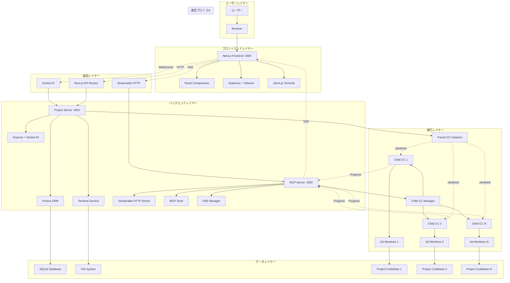
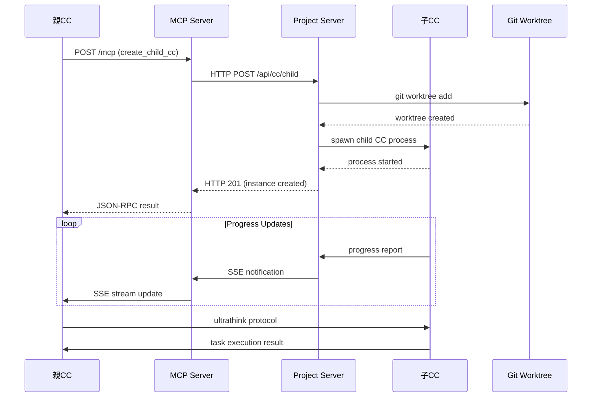
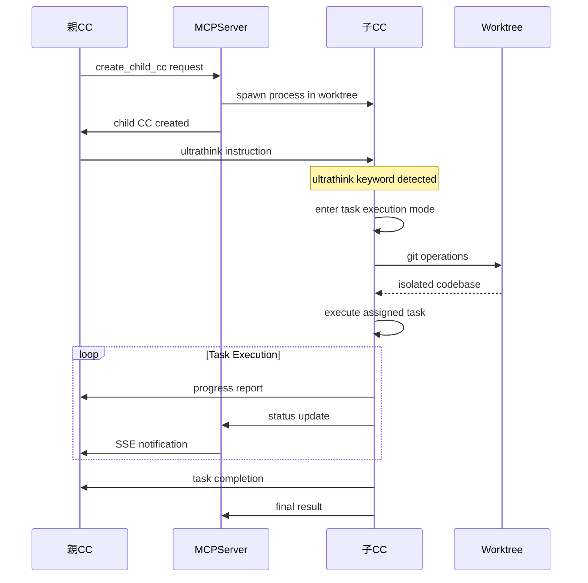

# Claude Code Terminal - 革命的MCPアーキテクチャ設計

## 1. システム概要

**Claude Code Terminal**は、Model Context Protocol (MCP) + Streamable HTTP + Server-Sent Eventsによる**完全自律型**Claude Code並列実行システムです。従来のマイクロサービスアーキテクチャを超越し、**親子Claude Code階層管理**と**リアルタイム通信**を実現する次世代プラットフォームです。

### 🚀 革新的特徴

- **MCP Server**: 並列実行制御の中央司令塔
- **Streamable HTTP**: 単一エンドポイントでの統合通信
- **Server-Sent Events**: 双方向リアルタイム通信
- **ultrathinkプロトコル**: 確実な親子CC間指示伝達
- **Git Worktree**: タスクごとの隔離実行環境

## 2. 革命的システム構成図



## 3. レイヤー別詳細設計

### 3.1 フロントエンドレイヤー (Port 3000)

#### **技術スタック**
```typescript
Next.js 14 (App Router)     // React フレームワーク
TypeScript                  // 型安全性
Tailwind CSS v3             // ユーティリティCSS
shadcn/ui                   // モダンUIコンポーネント
xterm.js                    // ターミナルエミュレーション
Socket.IO Client            // リアルタイム通信
React Query                 // データフェッチング
Zustand                     // 状態管理
```

#### **主要コンポーネント**

| コンポーネント | 役割 | ファイルパス |
|---------------|------|-------------|
| **ProjectDashboard** | プロジェクト管理UI | `app/dashboard/page.tsx` |
| **ProjectDetail** | 詳細管理・CC起動 | `app/dashboard/[projectId]/page.tsx` |
| **TerminalTabs** | 並列ターミナル管理 | `components/terminal/terminal-tabs.tsx` |
| **CCTerminal** | Claude Code専用ターミナル | `components/terminal/cc-terminal.tsx` |
| **TaskUploadDialog** | YAML タスク定義アップロード | `components/dashboard/task-upload-dialog.tsx` |

#### **状態管理フロー**

```typescript
// Zustand Store
interface ProjectStore {
  currentProject: Project | null;
  parentCC: CCInstance | null;
  childCCs: CCInstance[];
  
  // Actions
  setCurrentProject: (project: Project) => void;
  setParentCC: (cc: CCInstance) => void;
  addChildCC: (cc: CCInstance) => void;
}

// React Query Hooks
const { data: projects } = useProjects();
const { data: tasks } = useProjectTasks(projectId);
const { mutate: createProject } = useCreateProject();
```

### 3.2 MCP サーバーレイヤー (Port 3002)

#### **革命的アーキテクチャ**

**Streamable HTTP Server** - 並列実行制御の中央司令塔

```typescript
class StreamableMCPServer {
  // 単一エンドポイント `/mcp` で全通信を統合
  private handleMCPRequest(req: Request, res: Response): void
  private handleMCPStream(req: Request, res: Response): void
  
  // Server-Sent Events管理
  private activeConnections: Map<string, Response>
  private sendSSEMessage(res: Response, message: MCPMessage): void
  
  // MCP Tools
  private handleCreateChildCC(): Promise<ChildCCResult>
  private handleGetAvailableTasks(): Promise<Task[]>
  private handleUpdateTaskStatus(): Promise<TaskResult>
}
```

#### **MCP通信プロトコル**

```json
// 1. MCP Initialize
{
  "jsonrpc": "2.0",
  "method": "initialize",
  "params": {}
}

// 2. Tools List
{
  "jsonrpc": "2.0", 
  "method": "tools/list",
  "params": {}
}

// 3. Tool Call (子CC起動)
{
  "jsonrpc": "2.0",
  "method": "tools/call",
  "params": {
    "name": "create_child_cc",
    "arguments": {
      "parentInstanceId": "parent-cc-123",
      "taskId": "task-456",
      "instruction": "詳細なタスク指示",
      "projectWorkdir": "/project/path"
    }
  }
}

// 4. SSE Progress Notification
data: {
  "jsonrpc": "2.0",
  "method": "notification/progress", 
  "params": {
    "taskId": "task-456",
    "stage": "worktree_created",
    "message": "Git worktree created successfully"
  }
}
```

#### **利用可能なMCPツール**

| ツール名 | 機能 | 入力パラメータ | 戻り値 |
|---------|------|-------------|--------|
| `create_child_cc` | 子CC並列起動 | parentInstanceId, taskId, instruction, projectWorkdir | ChildCCResult |
| `get_available_tasks` | 利用可能タスク取得 | projectId | Task[] |
| `update_task_status` | タスク状況更新 | taskId, status, result | TaskResult |

### 3.3 プロジェクトサーバーレイヤー (Port 3001)

#### **技術スタック**
```typescript
Express.js                  // RESTful API
Socket.IO                   // WebSocket通信
Prisma ORM                  // データベースORM
SQLite                      // 軽量データベース
unbuffer                    // PTY エミュレーション
```

#### **主要サービス**

```typescript
// CC管理サービス
class CCService {
  async createParentCC(socket: Socket, data: CreateParentCCData): Promise<void>
  async createChildCC(socket: Socket, data: CreateChildCCData): Promise<void>
  async startChildCC(options: StartChildCCOptions): Promise<void>
  async destroyCC(socketId: string): Promise<void>
  
  // ultrathink プロトコル
  private formatUltrathinkInstruction(instruction: string, task: Task): string
  async sendUltrathinkMessage(childInstanceId: string, message: string): Promise<void>
  async handleUltrathinkResponse(socket: Socket, response: string): Promise<void>
}

// ターミナル管理サービス  
class TerminalService {
  async createTerminal(socket: Socket, options: TerminalOptions): Promise<void>
  sendData(socketId: string, data: string): void
  handleInput(socket: Socket, data: string): void
  resizeTerminal(socketId: string, cols: number, rows: number): void
}

// Git Worktree管理サービス
class WorktreeService {
  async createWorktree(basePath: string, worktreeName: string): Promise<string>
  async removeWorktree(basePath: string, worktreeName: string): Promise<void>
  async listWorktrees(basePath: string): Promise<WorktreeInfo[]>
}
```

#### **REST API設計**

```typescript
// プロジェクト管理API
router.get('/api/projects', listProjects);
router.post('/api/projects', createProject);
router.get('/api/projects/:id', getProject);
router.patch('/api/projects/:id', updateProject);
router.delete('/api/projects/:id', deleteProject);

// タスク管理API
router.get('/api/projects/:projectId/tasks', getProjectTasks);
router.get('/api/tasks/ready/:projectId', getReadyTasks);
router.patch('/api/tasks/:id/status', updateTaskStatus);

// CC管理API
router.post('/api/cc/parent', createParentCC);
router.post('/api/cc/child', createChildCC);
router.patch('/api/cc/:id/status', updateCCStatus);
router.post('/api/cc/:id/heartbeat', heartbeat);
```

### 3.4 データレイヤー

#### **Prisma Schema設計**

```prisma
// プロジェクト管理
model Project {
  id          String   @id @default(cuid())
  name        String
  description String?
  workdir     String
  status      String   @default("active")
  configJson  String?
  createdAt   DateTime @default(now())
  updatedAt   DateTime @updatedAt
  
  tasks       Task[]
  requirements Requirement[]
  features    Feature[]
}

// タスク管理
model Task {
  id            String    @id @default(cuid())
  projectId     String
  parentTaskId  String?
  name          String
  description   String?
  status        TaskStatus @default(PENDING)
  priority      Int       @default(5)
  assignedTo    String?
  taskType      String
  inputData     String?
  outputData    String?
  instruction   String?
  worktreePath  String?
  createdAt     DateTime  @default(now())
  updatedAt     DateTime  @updatedAt
  startedAt     DateTime?
  completedAt   DateTime?
  
  project       Project   @relation(fields: [projectId], references: [id])
  parentTask    Task?     @relation("TaskHierarchy", fields: [parentTaskId], references: [id])
  childTasks    Task[]    @relation("TaskHierarchy")
  dependencies  TaskDependency[]
  logs          TaskLog[]
}

// CC インスタンス管理
model CCInstance {
  id                String    @id @default(cuid())
  name              String
  type              CCType
  status            CCStatus  @default(IDLE)
  worktreePath      String?
  parentInstanceId  String?
  processId         String?
  socketId          String?
  createdAt         DateTime  @default(now())
  lastHeartbeat     DateTime?
  
  parentInstance    CCInstance? @relation("CCHierarchy", fields: [parentInstanceId], references: [id])
  childInstances    CCInstance[] @relation("CCHierarchy")
  logs              CCLog[]
}

enum TaskStatus {
  PENDING
  QUEUED  
  RUNNING
  COMPLETED
  FAILED
}

enum CCType {
  PARENT
  CHILD
}

enum CCStatus {
  IDLE
  RUNNING
  STOPPED
  ERROR
}
```

## 4. 通信フロー詳細

### 4.1 MCP通信フロー



### 4.2 ultrathink プロトコルフロー



### 4.3 リアルタイム通信アーキテクチャ

```typescript
// Frontend側
const eventSource = new EventSource('/api/mcp-stream');
eventSource.onmessage = (event) => {
  const notification = JSON.parse(event.data);
  // リアルタイム進捗更新
  updateTaskProgress(notification.params);
};

// MCP Server側  
class StreamableMCPServer {
  private sendSSEMessage(res: Response, message: MCPNotification): void {
    const data = JSON.stringify(message);
    res.write(`data: ${data}\n\n`);
  }
  
  // 子CC進捗通知
  private notifyProgress(sessionId: string, progress: ProgressData): void {
    const connection = this.activeConnections.get(sessionId);
    if (connection) {
      this.sendSSEMessage(connection, {
        jsonrpc: '2.0',
        method: 'notification/progress',
        params: progress
      });
    }
  }
}
```

## 5. スケーラビリティ設計

### 5.1 並列実行制御

```typescript
interface ParallelExecutionConfig {
  maxParallelCCs: number;        // 最大並列CC数 (default: 5)
  taskQueueSize: number;         // タスクキューサイズ  
  worktreeCleanupDelay: number;  // Worktree削除遅延時間
  heartbeatInterval: number;     // ハートビート間隔
}

class TaskScheduler {
  private taskQueue: PriorityQueue<Task>;
  private runningTasks: Map<string, TaskExecution>;
  
  async scheduleTask(task: Task): Promise<void> {
    // 依存関係チェック
    if (this.checkDependencies(task)) {
      this.taskQueue.enqueue(task, task.priority);
    }
  }
  
  async executeNextTask(): Promise<void> {
    if (this.runningTasks.size < this.config.maxParallelCCs) {
      const task = this.taskQueue.dequeue();
      if (task) {
        await this.startChildCC(task);
      }
    }
  }
}
```

### 5.2 リソース管理

```typescript
class ResourceManager {
  private ccInstances: Map<string, CCInstance>;
  private worktrees: Map<string, WorktreeInfo>;
  private systemMetrics: SystemMetrics;
  
  async allocateResources(task: Task): Promise<ResourceAllocation> {
    // システムリソースチェック
    const availableMemory = this.systemMetrics.availableMemory;
    const availableCPU = this.systemMetrics.availableCPU;
    
    if (availableMemory < this.config.minMemoryPerCC) {
      throw new Error('Insufficient memory for new CC instance');
    }
    
    return {
      ccInstanceId: this.generateInstanceId(),
      worktreePath: await this.allocateWorktree(task),
      resourceLimits: this.calculateResourceLimits()
    };
  }
}
```

## 6. セキュリティ・信頼性設計

### 6.1 プロセス分離

```typescript
// 各子CCは独立したプロセスとWorktreeで実行
class ChildCCManager {
  async spawnChildCC(options: SpawnOptions): Promise<ChildProcess> {
    const childProcess = spawn('claude', [], {
      cwd: options.worktreePath,        // 独立したworktree
      stdio: 'pipe',
      env: {
        ...process.env,
        CC_INSTANCE_ID: options.instanceId,
        CC_TYPE: 'child',
        CC_SANDBOX: 'true'              // サンドボックスモード
      }
    });
    
    // プロセス監視
    childProcess.on('exit', this.handleProcessExit);
    childProcess.on('error', this.handleProcessError);
    
    return childProcess;
  }
}
```

### 6.2 エラーハンドリング・復旧

```typescript
class ErrorRecoveryManager {
  async handleCCFailure(instanceId: string, error: Error): Promise<void> {
    // 1. エラーログ記録
    await this.logError(instanceId, error);
    
    // 2. 関連タスクの状態更新
    await this.updateTaskStatus(instanceId, 'failed');
    
    // 3. Worktreeクリーンアップ
    await this.cleanupWorktree(instanceId);
    
    // 4. 自動リトライ判定
    if (this.shouldRetry(error)) {
      await this.scheduleRetry(instanceId);
    }
    
    // 5. 親CCに通知
    await this.notifyParentCC(instanceId, error);
  }
}
```

## 7. 監視・ログ設計

### 7.1 ログ統合管理

```typescript
class LoggingManager {
  async logCCEvent(event: CCEvent): Promise<void> {
    const logEntry = {
      timestamp: new Date().toISOString(),
      instanceId: event.instanceId,
      type: event.type,
      level: event.level,
      message: event.message,
      metadata: event.metadata,
      traceId: event.traceId
    };
    
    // データベースログ
    await this.prisma.ccLog.create({ data: logEntry });
    
    // 構造化ログ出力
    console.log(JSON.stringify(logEntry));
    
    // リアルタイム通知（エラーレベルの場合）
    if (event.level === 'error') {
      await this.notifyError(logEntry);
    }
  }
}
```

### 7.2 メトリクス収集

```typescript
class MetricsCollector {
  private metrics = {
    activeCCInstances: 0,
    totalTasksExecuted: 0,
    averageTaskDuration: 0,
    errorRate: 0,
    resourceUtilization: {
      cpu: 0,
      memory: 0,
      disk: 0
    }
  };
  
  async collectMetrics(): Promise<SystemMetrics> {
    // CC インスタンス数
    this.metrics.activeCCInstances = await this.countActiveCCs();
    
    // リソース使用率
    this.metrics.resourceUtilization = await this.getResourceUsage();
    
    // タスク実行統計
    const taskStats = await this.getTaskStatistics();
    this.metrics.averageTaskDuration = taskStats.averageDuration;
    this.metrics.errorRate = taskStats.errorRate;
    
    return this.metrics;
  }
}
```

## 8. 拡張性・将来展望

### 8.1 エンタープライズ機能

```typescript
// 認証・認可システム
interface AuthenticationLayer {
  authenticateUser(token: string): Promise<User>;
  authorizeAction(user: User, action: string, resource: string): Promise<boolean>;
  createSession(user: User): Promise<Session>;
}

// 分散実行システム
interface DistributedExecution {
  registerWorkerNode(node: WorkerNode): Promise<void>;
  distributeTask(task: Task): Promise<WorkerNode>;
  collectResults(taskId: string): Promise<TaskResult>;
}
```

### 8.2 Kubernetes拡張

```yaml
# MCP Server Deployment
apiVersion: apps/v1
kind: Deployment
metadata:
  name: mcp-server
spec:
  replicas: 3
  selector:
    matchLabels:
      app: mcp-server
  template:
    metadata:
      labels:
        app: mcp-server
    spec:
      containers:
      - name: mcp-server
        image: claude-code-terminal/mcp-server:latest
        ports:
        - containerPort: 3002
        env:
        - name: PROJECT_SERVER_URL
          value: "http://project-server:3001"
```

## 9. パフォーマンス最適化

### 9.1 通信最適化

```typescript
// Connection Pooling
class ConnectionPool {
  private connections: Map<string, PooledConnection> = new Map();
  
  async getConnection(sessionId: string): Promise<PooledConnection> {
    if (!this.connections.has(sessionId)) {
      const connection = await this.createConnection(sessionId);
      this.connections.set(sessionId, connection);
    }
    return this.connections.get(sessionId)!;
  }
}

// Batch Processing
class BatchProcessor {
  private batchQueue: TaskBatch[] = [];
  
  async processBatch(): Promise<void> {
    const batch = this.batchQueue.shift();
    if (batch) {
      await Promise.all(batch.tasks.map(task => this.executeTask(task)));
    }
  }
}
```

### 9.2 キャッシング戦略

```typescript
class CacheManager {
  private taskCache = new LRUCache<string, Task>(1000);
  private resultCache = new LRUCache<string, TaskResult>(500);
  
  async getCachedTask(taskId: string): Promise<Task | null> {
    return this.taskCache.get(taskId) || null;
  }
  
  async cacheTaskResult(taskId: string, result: TaskResult): Promise<void> {
    this.resultCache.set(taskId, result);
  }
}
```

---

## 結論

この**革命的MCPアーキテクチャ**により、Claude Code Terminalは従来の開発プロセスを根本的に変革します：

### 🎯 **達成された革新**

1. **完全自律型オーケストレーション**: 親CCが自律的に子CCを管理
2. **リアルタイム通信**: Streamable HTTP + SSEによる即座の状態更新  
3. **スケーラブル並列実行**: MCPプロトコルによる効率的なタスク分散
4. **隔離実行環境**: Git Worktreeによる安全な並列処理
5. **統合開発体験**: WebベースのモダンUIと完全な日本語対応

### 🚀 **次世代AI開発の基盤**

このアーキテクチャは、AI駆動開発の未来を実現する強固な基盤を提供します。Model Context Protocolの標準化により、他のAIシステムとの相互運用性も確保され、真に革命的な開発エコシステムの構築が可能になります。

**Claude Code Terminalで、AI開発の新時代を体験してください！**