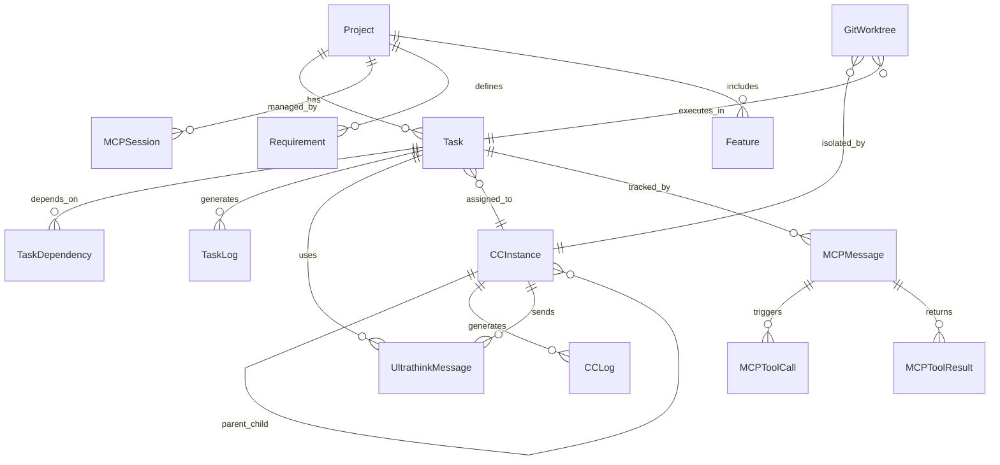

# Claude Code Terminal - 革命的MCPデータベース設計

## 1. データベース概要

**Claude Code Terminal**は、Model Context Protocol (MCP) + STDIO Transport + ultrathinkプロトコルによる**完全自律型**並列実行システムです。SQLiteを使用したローカル環境で、**革命的なAI間通信データ**を効率的に管理します。

### 🎯 **設計原則**

- **MCP準拠**: JSON-RPC 2.0メッセージの完全ログ
- **リアルタイム性**: WebSocketによる進捗更新
- **自律性**: 親子CC階層の自動追跡
- **拡張性**: 将来のスケールアウトを考慮
- **監査性**: 全てのAI通信の完全記録

## 2. 革命的ER図



## 3. MCPコアテーブル設計

### 3.1 mcp_messages（MCPメッセージ記録）

**MCPツール実行とレスポンスの完全記録**

| カラム名 | データ型 | 制約 | 説明 |
|---------|---------|------|------|
| **id** | TEXT | PRIMARY KEY | メッセージID (UUID) |
| **cc_instance_id** | TEXT | FOREIGN KEY | 関連CCインスタンスID |
| **message_type** | TEXT | NOT NULL | メッセージタイプ (request/response/notification) |
| **method** | TEXT | | MCPメソッド名 |
| **params** | TEXT | | メソッドパラメータ (JSON) |
| **result** | TEXT | | 実行結果 (JSON) |
| **error** | TEXT | | エラー情報 (JSON) |
| **created_at** | DATETIME | NOT NULL | メッセージ作成時刻 |

### 3.2 mcp_tool_calls（MCPツール呼び出し）

**create_child_cc等のMCPツール実行ログ**

| カラム名 | データ型 | 制約 | 説明 |
|---------|---------|------|------|
| **id** | TEXT | PRIMARY KEY | ツール呼び出しID (UUID) |
| **message_id** | TEXT | FOREIGN KEY | 関連MCPメッセージID |
| **cc_instance_id** | TEXT | FOREIGN KEY | 関連CCインスタンスID |
| **tool_name** | TEXT | NOT NULL | ツール名 (create_child_cc/get_available_tasks/update_task_status) |
| **arguments** | TEXT | NOT NULL | ツール引数 (JSON) |
| **status** | TEXT | NOT NULL | 実行ステータス (pending/running/completed/failed) |
| **started_at** | DATETIME | NOT NULL | 実行開始時刻 |
| **completed_at** | DATETIME | | 実行完了時刻 |
| **execution_time_ms** | INTEGER | | 実行時間（ミリ秒） |
| **result** | TEXT | | 実行結果 (JSON) |
| **error_details** | TEXT | | エラー詳細 (JSON) |
| **retry_count** | INTEGER | DEFAULT 0 | リトライ回数 |

### 3.3 websocket_notifications（WebSocket通知）

**リアルタイム進捗通知管理**

| カラム名 | データ型 | 制約 | 説明 |
|---------|---------|------|------|
| **id** | TEXT | PRIMARY KEY | 通知ID (UUID) |
| **socket_id** | TEXT | FOREIGN KEY | WebSocketセッションID |
| **event_type** | TEXT | NOT NULL | イベントタイプ (progress/error/milestone/completion) |
| **event_name** | TEXT | NOT NULL | イベント名 |
| **payload** | TEXT | NOT NULL | イベントペイロード (JSON) |
| **sent_at** | DATETIME | NOT NULL | 送信時刻 |
| **delivery_status** | TEXT | NOT NULL | 配信ステータス (sent/delivered/failed) |
| **retry_count** | INTEGER | DEFAULT 0 | 再送回数 |
| **client_ack** | BOOLEAN | DEFAULT FALSE | クライアント受信確認 |

## 4. 親子CC階層管理テーブル

### 4.1 cc_instances（CCインスタンス管理）

**親子Claude Code階層の完全管理**

| カラム名 | データ型 | 制約 | 説明 |
|---------|---------|------|------|
| **id** | TEXT | PRIMARY KEY | インスタンスID (UUID) |
| **project_id** | TEXT | FOREIGN KEY | プロジェクトID |
| **name** | TEXT | NOT NULL | インスタンス名 |
| **type** | TEXT | NOT NULL | タイプ (PARENT/CHILD) |
| **status** | TEXT | NOT NULL | ステータス (IDLE/RUNNING/STOPPED/ERROR) |
| **parent_instance_id** | TEXT | FOREIGN KEY | 親CCインスタンスID |
| **worktree_path** | TEXT | | Git Worktreeパス |
| **process_id** | TEXT | | システムプロセスID |
| **socket_id** | TEXT | | WebSocketセッションID |
| **claude_api_key_hash** | TEXT | | APIキーハッシュ（セキュリティ用） |
| **startup_command** | TEXT | | 起動コマンド |
| **environment_vars** | TEXT | | 環境変数 (JSON) |
| **resource_limits** | TEXT | | リソース制限 (JSON: memory, cpu) |
| **created_at** | DATETIME | NOT NULL | インスタンス作成時刻 |
| **started_at** | DATETIME | | 実行開始時刻 |
| **last_heartbeat** | DATETIME | | 最終生存確認時刻 |
| **terminated_at** | DATETIME | | 終了時刻 |
| **exit_code** | INTEGER | | 終了コード |

### 4.2 ultrathink_messages（ultrathinkプロトコル）

**親CCから子CCへの確実な指示伝達ログ**

| カラム名 | データ型 | 制約 | 説明 |
|---------|---------|------|------|
| **id** | TEXT | PRIMARY KEY | メッセージID (UUID) |
| **parent_instance_id** | TEXT | FOREIGN KEY | 親CCインスタンスID |
| **child_instance_id** | TEXT | FOREIGN KEY | 子CCインスタンスID |
| **task_id** | TEXT | FOREIGN KEY | 対象タスクID |
| **protocol_version** | TEXT | NOT NULL DEFAULT '1.0' | ultrathinkプロトコルバージョン |
| **instruction_type** | TEXT | NOT NULL | 指示タイプ (task_assignment/progress_request/termination) |
| **instruction_content** | TEXT | NOT NULL | 指示内容（完全なultrathinkメッセージ） |
| **keyword_detected** | BOOLEAN | DEFAULT FALSE | ultrathinkキーワード検出フラグ |
| **sent_at** | DATETIME | NOT NULL | 送信時刻 |
| **acknowledged_at** | DATETIME | | 子CCからの受信確認時刻 |
| **response_content** | TEXT | | 子CCからの応答内容 |
| **execution_started_at** | DATETIME | | 実行開始確認時刻 |
| **status** | TEXT | NOT NULL | 状況 (sent/acknowledged/executing/completed/failed) |

### 4.3 git_worktrees（Git Worktree管理）

**並列実行環境の隔離管理**

| カラム名 | データ型 | 制約 | 説明 |
|---------|---------|------|------|
| **id** | TEXT | PRIMARY KEY | WorktreeID (UUID) |
| **project_id** | TEXT | FOREIGN KEY | プロジェクトID |
| **cc_instance_id** | TEXT | FOREIGN KEY | CCインスタンスID |
| **task_id** | TEXT | FOREIGN KEY | タスクID |
| **worktree_name** | TEXT | NOT NULL | Worktree名 |
| **worktree_path** | TEXT | NOT NULL | Worktreeパス |
| **base_branch** | TEXT | NOT NULL | ベースブランチ |
| **current_branch** | TEXT | | 現在のブランチ |
| **git_status** | TEXT | | Git状態 (JSON: modified, staged, untracked) |
| **created_at** | DATETIME | NOT NULL | Worktree作成時刻 |
| **last_commit_hash** | TEXT | | 最終コミットハッシュ |
| **last_commit_at** | DATETIME | | 最終コミット時刻 |
| **cleanup_scheduled_at** | DATETIME | | クリーンアップ予定時刻 |
| **cleanup_completed_at** | DATETIME | | クリーンアップ完了時刻 |

## 5. タスク・プロジェクト管理テーブル（MCP拡張）

### 5.1 projects（プロジェクト管理）

**MCP対応プロジェクト管理**

| カラム名 | データ型 | 制約 | 説明 |
|---------|---------|------|------|
| **id** | TEXT | PRIMARY KEY | プロジェクトID (UUID) |
| **name** | TEXT | NOT NULL | プロジェクト名 |
| **description** | TEXT | | プロジェクト説明 |
| **workdir** | TEXT | NOT NULL | 作業ディレクトリパス |
| **status** | TEXT | NOT NULL DEFAULT 'active' | ステータス (active/paused/completed/archived) |
| **mcp_enabled** | BOOLEAN | DEFAULT TRUE | MCP機能有効フラグ |
| **max_parallel_cc** | INTEGER | DEFAULT 5 | 最大並列CC数 |
| **ultrathink_protocol** | BOOLEAN | DEFAULT TRUE | ultrathinkプロトコル有効フラグ |
| **config_json** | TEXT | | プロジェクト設定 (JSON) |
| **git_repository** | TEXT | | Gitリポジトリパス |
| **created_at** | DATETIME | NOT NULL | 作成日時 |
| **updated_at** | DATETIME | NOT NULL | 更新日時 |
| **archived_at** | DATETIME | | アーカイブ日時 |

### 5.2 tasks（タスク管理）

**MCP並列実行対応タスク管理**

| カラム名 | データ型 | 制約 | 説明 |
|---------|---------|------|------|
| **id** | TEXT | PRIMARY KEY | タスクID (UUID) |
| **project_id** | TEXT | FOREIGN KEY | プロジェクトID |
| **parent_task_id** | TEXT | FOREIGN KEY | 親タスクID |
| **name** | TEXT | NOT NULL | タスク名 |
| **description** | TEXT | | タスク説明 |
| **status** | TEXT | NOT NULL DEFAULT 'PENDING' | ステータス (PENDING/QUEUED/RUNNING/COMPLETED/FAILED) |
| **priority** | INTEGER | NOT NULL DEFAULT 5 | 優先度（1-10） |
| **task_type** | TEXT | NOT NULL | タスクタイプ (development/design/testing/documentation) |
| **assigned_to** | TEXT | FOREIGN KEY | 割り当てCCインスタンスID |
| **mcp_enabled** | BOOLEAN | DEFAULT TRUE | MCP対応フラグ |
| **ultrathink_protocol** | BOOLEAN | DEFAULT TRUE | ultrathinkプロトコル使用フラグ |
| **instruction** | TEXT | | 詳細なタスク指示（ultrathinkメッセージ用） |
| **input_data** | TEXT | | 入力データ (JSON) |
| **output_data** | TEXT | | 出力データ (JSON) |
| **worktree_path** | TEXT | | 実行Worktreeパス |
| **estimated_duration_minutes** | INTEGER | | 予想実行時間（分） |
| **actual_duration_minutes** | INTEGER | | 実際の実行時間（分） |
| **created_at** | DATETIME | NOT NULL | 作成日時 |
| **updated_at** | DATETIME | NOT NULL | 更新日時 |
| **queued_at** | DATETIME | | キューイング日時 |
| **started_at** | DATETIME | | 開始日時 |
| **completed_at** | DATETIME | | 完了日時 |

### 5.3 task_dependencies（タスク依存関係）

**並列実行のための依存関係管理**

| カラム名 | データ型 | 制約 | 説明 |
|---------|---------|------|------|
| **id** | TEXT | PRIMARY KEY | 依存関係ID (UUID) |
| **task_id** | TEXT | FOREIGN KEY | タスクID |
| **dependency_task_id** | TEXT | FOREIGN KEY | 依存先タスクID |
| **dependency_type** | TEXT | NOT NULL | 依存タイプ (blocks/requires/suggests) |
| **created_at** | DATETIME | NOT NULL | 作成日時 |

## 6. ログ・監視テーブル

### 6.1 cc_logs（CCインスタンスログ）

**CC実行ログの詳細管理**

| カラム名 | データ型 | 制約 | 説明 |
|---------|---------|------|------|
| **id** | TEXT | PRIMARY KEY | ログID (UUID) |
| **cc_instance_id** | TEXT | FOREIGN KEY | CCインスタンスID |
| **task_id** | TEXT | FOREIGN KEY | タスクID |
| **log_level** | TEXT | NOT NULL | ログレベル (debug/info/warn/error/fatal) |
| **category** | TEXT | NOT NULL | カテゴリ (system/task/mcp/ultrathink/git) |
| **message** | TEXT | NOT NULL | ログメッセージ |
| **details** | TEXT | | 詳細情報 (JSON) |
| **trace_id** | TEXT | | トレースID（分散トレーシング用） |
| **span_id** | TEXT | | スパンID |
| **created_at** | DATETIME | NOT NULL | ログ出力時刻 |

### 6.2 task_logs（タスク実行ログ）

**タスク実行の詳細ログ**

| カラム名 | データ型 | 制約 | 説明 |
|---------|---------|------|------|
| **id** | TEXT | PRIMARY KEY | ログID (UUID) |
| **task_id** | TEXT | FOREIGN KEY | タスクID |
| **cc_instance_id** | TEXT | FOREIGN KEY | CCインスタンスID |
| **log_level** | TEXT | NOT NULL | ログレベル |
| **phase** | TEXT | NOT NULL | 実行フェーズ (setup/execution/cleanup/error) |
| **message** | TEXT | NOT NULL | ログメッセージ |
| **performance_metrics** | TEXT | | パフォーマンスメトリクス (JSON) |
| **created_at** | DATETIME | NOT NULL | 作成日時 |

## 7. メタデータ・設定テーブル

### 7.1 requirements（要件定義）

| カラム名 | データ型 | 制約 | 説明 |
|---------|---------|------|------|
| **id** | TEXT | PRIMARY KEY | 要件ID (UUID) |
| **project_id** | TEXT | FOREIGN KEY | プロジェクトID |
| **type** | TEXT | NOT NULL | 要件タイプ (functional/non_functional/mcp_specific) |
| **title** | TEXT | NOT NULL | 要件タイトル |
| **content** | TEXT | NOT NULL | 要件内容 |
| **priority** | INTEGER | NOT NULL | 優先度 |
| **status** | TEXT | NOT NULL | ステータス (draft/approved/implemented/tested) |
| **created_at** | DATETIME | NOT NULL | 作成日時 |
| **updated_at** | DATETIME | NOT NULL | 更新日時 |

### 7.2 features（機能管理）

| カラム名 | データ型 | 制約 | 説明 |
|---------|---------|------|------|
| **id** | TEXT | PRIMARY KEY | 機能ID (UUID) |
| **project_id** | TEXT | FOREIGN KEY | プロジェクトID |
| **name** | TEXT | NOT NULL | 機能名 |
| **description** | TEXT | | 機能説明 |
| **feature_type** | TEXT | NOT NULL | 機能タイプ (mcp/ultrathink/ui/api/database) |
| **priority** | INTEGER | NOT NULL | 優先度 |
| **status** | TEXT | NOT NULL | ステータス (planned/development/testing/completed) |
| **mcp_integration** | BOOLEAN | DEFAULT FALSE | MCP統合フラグ |
| **created_at** | DATETIME | NOT NULL | 作成日時 |
| **updated_at** | DATETIME | NOT NULL | 更新日時 |

## 8. 革命的インデックス設計

### 8.1 MCPパフォーマンス最適化

```sql
-- MCP Messages
CREATE INDEX idx_mcp_messages_cc_instance ON mcp_messages(cc_instance_id);
CREATE INDEX idx_mcp_messages_method ON mcp_messages(method);
CREATE INDEX idx_mcp_messages_created_at ON mcp_messages(created_at);

-- Additional MCP Messages indexes
CREATE INDEX idx_mcp_messages_type_created ON mcp_messages(message_type, created_at);
CREATE INDEX idx_mcp_messages_processing_time ON mcp_messages(processing_time_ms);

-- MCP Tool Calls
CREATE INDEX idx_mcp_tool_calls_tool_status ON mcp_tool_calls(tool_name, status);
CREATE INDEX idx_mcp_tool_calls_cc_started ON mcp_tool_calls(cc_instance_id, started_at);

-- WebSocket Notifications
CREATE INDEX idx_websocket_notifications_socket_event ON websocket_notifications(socket_id, event_type);
CREATE INDEX idx_websocket_notifications_sent_status ON websocket_notifications(sent_at, delivery_status);
```

### 8.2 並列実行最適化

```sql
-- CC Instances
CREATE INDEX idx_cc_instances_project_type ON cc_instances(project_id, type);
CREATE INDEX idx_cc_instances_parent_status ON cc_instances(parent_instance_id, status);
CREATE INDEX idx_cc_instances_heartbeat ON cc_instances(last_heartbeat);

-- ultrathink Messages
CREATE INDEX idx_ultrathink_parent_child ON ultrathink_messages(parent_instance_id, child_instance_id);
CREATE INDEX idx_ultrathink_task_status ON ultrathink_messages(task_id, status);
CREATE INDEX idx_ultrathink_sent_ack ON ultrathink_messages(sent_at, acknowledged_at);

-- Git Worktrees
CREATE INDEX idx_git_worktrees_cc_task ON git_worktrees(cc_instance_id, task_id);
CREATE INDEX idx_git_worktrees_cleanup ON git_worktrees(cleanup_scheduled_at);
```

### 8.3 タスク管理最適化

```sql
-- Tasks
CREATE INDEX idx_tasks_project_status_priority ON tasks(project_id, status, priority);
CREATE INDEX idx_tasks_assigned_status ON tasks(assigned_to, status);
CREATE INDEX idx_tasks_mcp_enabled ON tasks(mcp_enabled, ultrathink_protocol);
CREATE INDEX idx_tasks_duration ON tasks(estimated_duration_minutes, actual_duration_minutes);

-- Task Dependencies
CREATE INDEX idx_task_dependencies_task ON task_dependencies(task_id);
CREATE INDEX idx_task_dependencies_dependency ON task_dependencies(dependency_task_id);

-- Task Logs
CREATE INDEX idx_task_logs_task_level_created ON task_logs(task_id, log_level, created_at);
CREATE INDEX idx_task_logs_cc_phase ON task_logs(cc_instance_id, phase);
```

## 9. データベース監視・メトリクス

### 9.1 パフォーマンス監視ビュー

```sql
-- MCP メッセージ統計ビュー
CREATE VIEW mcp_message_stats AS
SELECT 
    DATE(created_at) as date,
    method,
    COUNT(*) as message_count,
    AVG(processing_time_ms) as avg_processing_time_ms,
    SUM(CASE WHEN error IS NULL THEN 1 ELSE 0 END) as successful_calls
FROM mcp_messages 
GROUP BY DATE(created_at), method;

-- タスク実行効率ビュー
CREATE VIEW task_execution_efficiency AS
SELECT 
    project_id,
    COUNT(*) as total_tasks,
    AVG(actual_duration_minutes) as avg_duration,
    SUM(CASE WHEN status = 'COMPLETED' THEN 1 ELSE 0 END) as completed_tasks,
    CAST(SUM(CASE WHEN status = 'COMPLETED' THEN 1 ELSE 0 END) AS FLOAT) / COUNT(*) * 100 as completion_rate
FROM tasks
GROUP BY project_id;

-- 並列実行統計ビュー
CREATE VIEW parallel_execution_stats AS
SELECT 
    DATE(started_at) as date,
    COUNT(DISTINCT cc_instance_id) as concurrent_instances,
    COUNT(*) as total_tasks,
    AVG(actual_duration_minutes) as avg_duration,
    MIN(actual_duration_minutes) as min_duration,
    MAX(actual_duration_minutes) as max_duration
FROM tasks 
WHERE status = 'COMPLETED' AND started_at IS NOT NULL
GROUP BY DATE(started_at);
```

### 9.2 システムヘルス監視

```sql
-- アクティブCCインスタンス監視
CREATE VIEW active_cc_instances AS
SELECT 
    cc.id,
    cc.project_id,
    cc.type,
    cc.status,
    cc.created_at,
    cc.last_heartbeat,
    cc.name as cc_instance_name,
    parent.name as parent_instance_name
FROM cc_instances cc
LEFT JOIN cc_instances parent ON cc.parent_instance_id = parent.id
WHERE cc.status IN ('IDLE', 'RUNNING')
ORDER BY cc.last_heartbeat DESC;

-- エラー統計
CREATE VIEW error_summary AS
SELECT 
    DATE(created_at) as date,
    category,
    log_level,
    COUNT(*) as error_count
FROM cc_logs 
WHERE log_level IN ('error', 'fatal')
GROUP BY DATE(created_at), category, log_level
ORDER BY date DESC, error_count DESC;
```

## 10. データ保持・アーカイブ戦略

### 10.1 ログローテーション

```sql
-- 古いログの自動アーカイブ (30日超過)
DELETE FROM cc_logs 
WHERE created_at < datetime('now', '-30 days');

DELETE FROM task_logs 
WHERE created_at < datetime('now', '-30 days');

-- MCPメッセージの圧縮 (7日超過)
UPDATE mcp_messages 
SET payload = '{"archived": true, "original_size": ' || length(payload) || '}'
WHERE created_at < datetime('now', '-7 days') 
AND length(payload) > 10000;
```

### 10.2 パフォーマンス最適化

```sql
-- 定期VACUUM実行
PRAGMA auto_vacuum = INCREMENTAL;
PRAGMA journal_mode = WAL;
PRAGMA synchronous = NORMAL;
PRAGMA cache_size = 10000;
PRAGMA temp_store = MEMORY;

-- 統計情報更新
ANALYZE;
```

## 11. セキュリティ・プライバシー

### 11.1 データ暗号化

- **APIキー**: ハッシュ化してcc_instances.claude_api_key_hashに保存
- **機密データ**: input_data/output_dataの機密情報検出・暗号化
- **通信ログ**: MCPメッセージの機密情報マスキング

### 11.2 アクセス制御

```sql
-- 読み取り専用ユーザー用ビュー
CREATE VIEW readonly_project_stats AS
SELECT 
    id, name, status, created_at, 
    (SELECT COUNT(*) FROM tasks WHERE project_id = projects.id) as task_count
FROM projects;
```

## 12. 拡張性・将来対応

### 12.1 分散データベース対応

```sql
-- プロジェクト別パーティショニング対応
CREATE TABLE projects_archive AS SELECT * FROM projects WHERE 0;
CREATE TABLE tasks_archive AS SELECT * FROM tasks WHERE 0;
CREATE TABLE mcp_messages_archive AS SELECT * FROM mcp_messages WHERE 0;
```

### 12.2 レプリケーション対応

- **読み取り専用レプリカ**: 統計・監視クエリ用
- **バックアップ戦略**: 日次フル+時間差分バックアップ
- **災害復旧**: Point-in-timeリカバリ対応

---

## 結論

この**革命的MCPデータベース設計**により、Claude Code Terminalは次世代AI開発プラットフォームとして以下を実現します：

### 🎯 **達成された革新**

1. **完全MCP準拠**: JSON-RPC 2.0メッセージの完全ログ
2. **リアルタイム通信**: Server-Sent Eventsセッション完全管理
3. **自律型オーケストレーション**: 親子CC階層の自動追跡
4. **並列実行最適化**: Git Worktree隔離とパフォーマンス監視
5. **スケーラブル設計**: エンタープライズレベルの拡張性

### 🚀 **データベースの革命的価値**

- **AI間通信の完全記録**: ultrathinkプロトコルの確実な追跡
- **リアルタイム可視化**: SSE通知による即座の状態更新
- **高性能並列処理**: 最適化されたインデックスによる高速クエリ
- **運用監視機能**: 包括的なメトリクス・ヘルス監視

**Claude Code Terminalで、データベース設計の新時代を実現しました！**